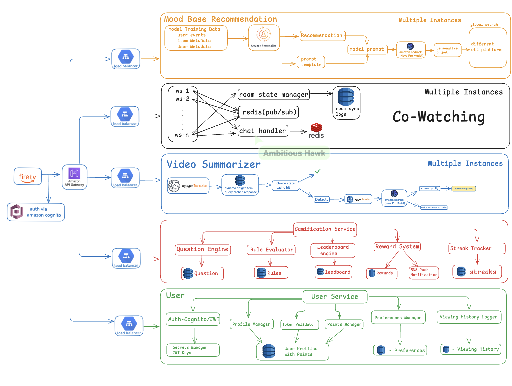
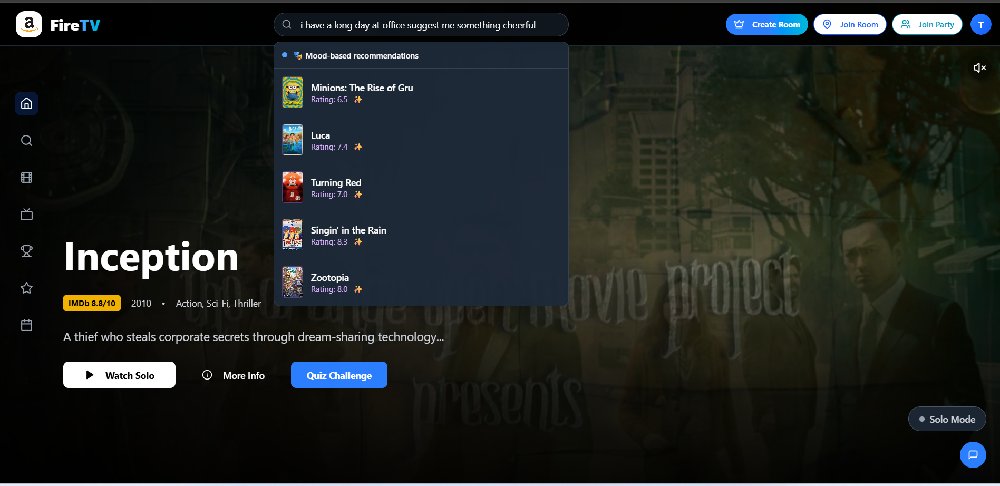
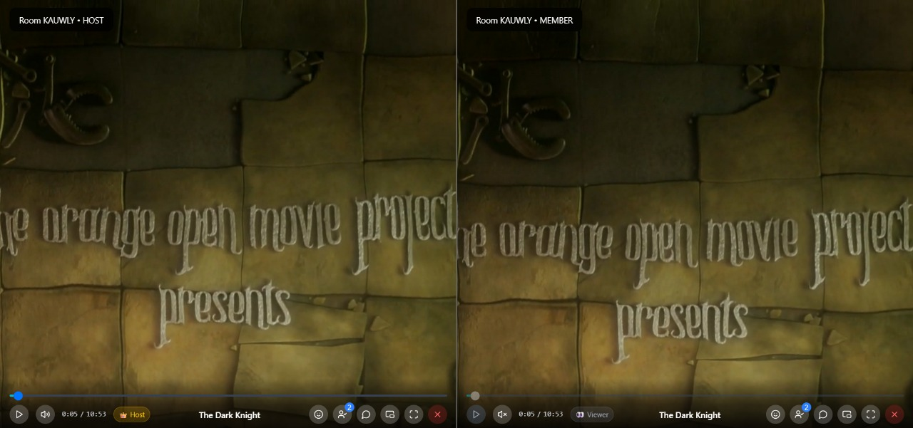
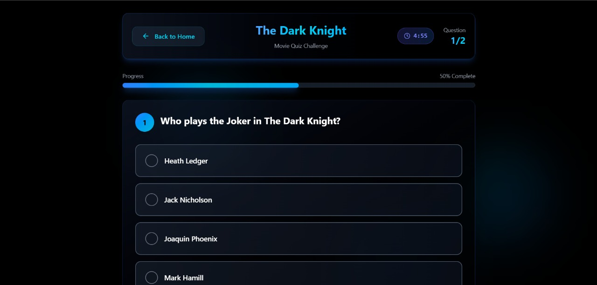
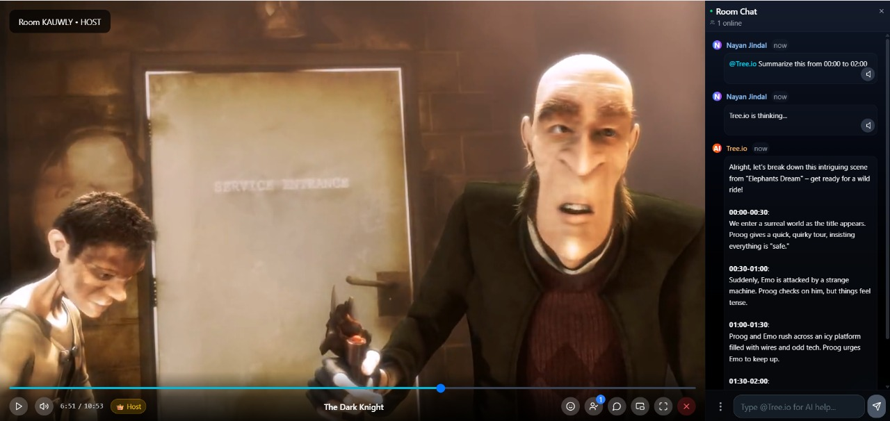
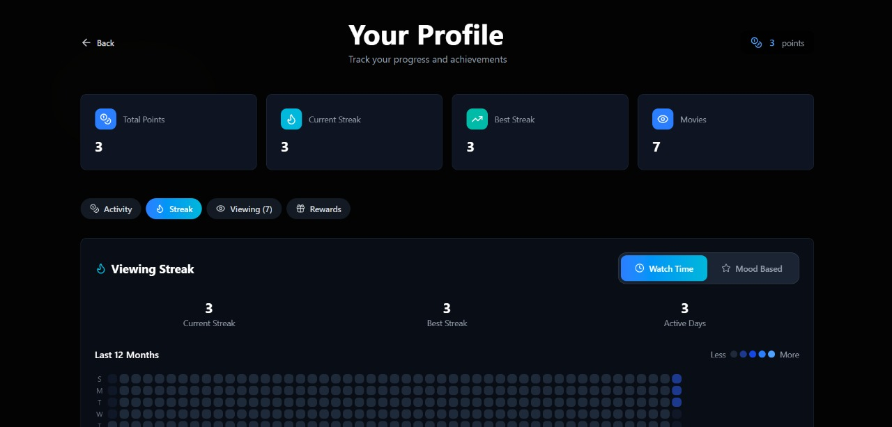

# Amazon Hackon Season-5
# 🎥 FireTV - Co-Watching Platform with Real-Time Sync, Mood-Based Recommendation & Gamification


Welcome to **FireTV** — a scalable, cloud-native co-watching platform built for **Amazon HackOn Season-5**. This system enables **millions of users** to watch videos together in real time, interact through chat, get personalized content suggestions, enjoy a **mood-based recommender**, and engage with gamified trivia — all in a **serverless and distributed architecture**.

---

## 🏗️ System Architecture



*The above diagram illustrates our scalable, cloud-native architecture designed to handle millions of concurrent users with real-time synchronization, mood-based recommendations, and gamification features.*

### Architecture Overview
Our platform follows a **microservices architecture** with the following key components:
- **Frontend Layer**: React-based web application with real-time WebSocket connections
- **API Gateway**: Amazon API Gateway for secure and scalable API management
- **Authentication**: Amazon Cognito for user management and JWT-based security
- **Real-time Communication**: WebSocket servers with Redis Pub/Sub for chat and sync
- **AI/ML Services**: Amazon Personalize, Transcribe, Polly, and Rekognition for intelligent features
- **Storage Layer**: DynamoDB for scalable NoSQL storage and caching
- **Notification System**: SNS for push notifications and user engagement

---

## 🚀 Project Highlights

- 🔁 **Synchronized Video Playback** across large user groups
- 💬 **Real-Time Chat Engine** using Redis Pub/Sub
- 🧠 **Mood-Based OTT Recommendations** via Amazon Personalize
- ✂️ **Video Summarization** using Amazon Transcribe & LLM-enhanced phrasing
- 🎮 **Gamification Layer** with leaderboards, streaks, and rewards
- 🔐 **Cognito-based Auth** and user preference tracking

---

## 🌟 Key Platform Features

### Mood-Based Recommender


Our platform features an **AI-powered mood-based recommender** that personalizes content suggestions based on user mood and viewing patterns:
- 🧠 **Personalized recommendations** using Amazon Personalize and mood signals
- 🎭 **Emotion-aware suggestions** for movies and shows
- 🔗 **Direct links** to OTT platforms for seamless viewing
- 📈 **Continuous learning** from user feedback and engagement

### Advanced Video Sync Interface


Our platform provides **millisecond-precise synchronization** across all connected users, ensuring everyone experiences the content at exactly the same moment.
**Production-ready synchronization** with enterprise-grade features:
- 👥 **Multi-user rooms** supporting thousands of concurrent viewers
- 💬 **Integrated chat** with real-time messaging
- 🎛️ **Host controls** for room management
- 📱 **Cross-platform compatibility** (web, mobile, smart TV)
- 🛡️ **Security features** with role-based permissions

### Interactive Gamification System


Engage users with **context-aware quizzes** and achievement systems:
- 🎮 **Real-time trivia** based on video content
- 🏆 **Leaderboards** with daily/weekly/monthly rankings
- ⭐ **Achievement badges** for various milestones
- 🔥 **Streak tracking** to encourage daily engagement
- 💎 **Reward redemption** system with virtual currency

### AI-Powered Video Summarization


Transform any video content into **intelligent summaries**:
- 🎙️ **Speech-to-text** conversion using Amazon Transcribe
- 🧠 **LLM-enhanced** content analysis and summarization
- 📝 **Multi-format outputs** (text, audio via Polly)
- ⚡ **Real-time processing** with DynamoDB caching
- 🎯 **Context-aware** summaries based on user preferences

### Comprehensive User Analytics


Beautiful, **data-rich user profiles** with complete viewing analytics:
- 📊 **Viewing history** with progress tracking
- 📈 **Engagement metrics** and activity patterns
- 🎭 **Mood-based** viewing recommendations
- 🔥 **Streak visualization** with heatmaps
- 🏅 **Achievement showcase** and progress tracking

---

### Frontend
- React 18+
- Vite (Build tool)
- Modern CSS/Tailwind CSS
- Socket.io Client

### Backend
- Node.js
- Express.js
- Socket.io Server
- RESTful APIs

### Video Processing
- Python
- AWS Lambda
- Machine Learning libraries
- Video analysis ✂️ Video Summarization
*AI-powered summarization detailed in System Modules section*

---

## 🧠 System Modules

### 1. 🔄 Co-Watching & Sync Engine� Quick Start Guide

### Prerequisites
- Node.js 18+
- Python 3.8+ (for video processing)
- Redis server (optional, for production)
- AWS Account

### 🛠️ Local Development Setup

**1. Clone and Install Dependencies**
```bash
git clone https://github.com/JaiBansal007/Hackon.git
cd Hackon

# Install frontend dependencies
cd Frontend && npm install

# Install backend dependencies  
cd ../server && npm install

# Install video processing dependencies (optional)
cd ../vedio-Sumarization/src && pip install -r requirements.txt
```

**2. Environment Configuration**
```bash
# Frontend .env
cd Frontend
echo "VITE_API_BASE_URL=http://localhost:5001" > .env
echo "VITE_SOCKET_URL=http://localhost:5001" >> .env

# Backend .env  
cd ../server
echo "PORT=5001" > .env
echo "NODE_ENV=development" >> .env
echo "MOOD_API_KEY=your_api_key_here" >> .env
```

**3. Start Development Servers**
```bash
# Terminal 1: Start Backend Server
cd server && npm run dev

# Terminal 2: Start Frontend Server  
cd Frontend && npm run dev
```
**4. Mood Analyzer Setup**
```bash
# Navigate to mood analyzer directory
cd ../polly-demo/dum

# Setup virtual environment and dependencies
pip install -r requirements.txt

# Create environment configuration
cp .env.example .env  # Fill with real values

# Run the mood analyzer application
python app/main.py
```

### 🎯 Try These Features:
1. **🎬 Create Watch Party**: Start synchronized viewing
2. **👥 Join Friends**: Use room codes for group sessions
3. **🎮 Play Quizzes**: Interactive real-time questions
4. **🧠 Mood Recommendations**: Get personalized suggestions
5. **📊 View Profile**: Track history and achievements

## 📁 Project Structure

```
📁 Hackon/
├── 📁 Frontend/                          # React 18+ Frontend Application
├── 📁 server/                            # Express.js Backend Server
├── 📁 vedio-Sumarization/                # AI Video Processing Service
├── 📁 polly-demo/                        # Amazon Polly Integration
├── 📁 mood_recommender/                  # Mood Based recommender
├── 📁 Docs/                              # Documentation Assets
├── 📖 README.md                          # Main Project Documentation
└── 📄 .gitignore                         # Git Ignore Rules

```

## 🚀 Deployment

### Frontend Deployment
```bash
cd Frontend
npm run build
# Deploy the dist/ folder to your hosting service
```

### Backend Deployment
```bash
cd server
npm start
# Deploy to your preferred cloud platform
```

## 🔧 Available Scripts

### Frontend
- `npm run dev` - Start development server
- `npm run build` - Build for production
- `npm run preview` - Preview production build
- `npm run lint` - Run ESLint

### Backend
- `npm run dev` - Start development server with nodemon
- `npm start` - Start production server
- `npm test` - Run tests

## 🧠 System Modules

### 1. 🔄 Co-Watching & Sync Engine
- Real-time **WebSocket servers** (`ws-1` to `ws-n`)
- `room state manager` to sync play/pause/seek across users
- `chat handler` pushing and receiving messages through **Redis**
- Logs stored in Redis for sync playback state restoration

---

### 2. 🧼 Video Summarizer
- Uses **Amazon Transcribe** to convert video speech to text
- Queries **DynamoDB** for pre-summarized content
- LLM prompt construction via custom Phrase Pro Module
- Optionally produces TLDR using **Amazon Polly**

---

### 3. 📊 Mood-Based Recommendation Engine
<!--  -->
- Trains on:
  - User behavior
  - OTT item metadata
  - Viewing mood signals
- Uses **Amazon Personalize** to recommend shows/movies
- Delivers **personalized prompts** to the Phrase Pro model
- Output links direct users to external OTT platforms (Prime Video, etc.)

---

### 4. 🎮 Gamification Layer
- **Question Engine** triggers context-aware questions
- **Rule Evaluator** manages engagement criteria
- **Leaderboard Engine** tracks user rank in real time
- **Reward System** grants rewards via **SNS push notifications**
- **Streak Tracker** logs consistency & daily engagement

---

### 5. 👤 User Management
- Authenticated via **Amazon Cognito + JWT**
- **Secrets Manager** securely stores and rotates keys
- `Profile Manager`, `Preferences Manager`, and `Viewing History Logger` track user state
- **Points Manager** handles gamification integration


## ⚖️ Scaling Strategy

<!--  -->

| Component            | Scaling Method                                  |
|----------------------|-------------------------------------------------|
| WebSocket Layer      | Auto-scaled containers behind Load Balancer     |
| Redis Pub/Sub        | Horizontally scalable with clustered Redis      |
| Chat Sync            | Sharded channels to reduce write hotspots       |
| Video Summarizer     | Stateless microservices + DynamoDB cache layer |
| Personalization      | Pre-trained model inference on Amazon SageMaker |
| API Gateway          | Rate-limited + multi-tenant                     |
| Auth & User State    | Cognito (serverless) + Secrets Manager          |

---

## 🔐 Security Considerations

<!--  -->

- OAuth2 / JWT-based token validation using **Amazon Cognito**
- All inter-service calls secured via IAM roles & scoped policies
- Caching minimizes unnecessary API exposure
- Secrets (e.g., JWT signing keys) handled by **AWS Secrets Manager**

---

## 📦 Tech Stack

| Layer        | Technology               |
|--------------|---------------------------|
| Frontend     | FireTV / Web App (React) |
| API Gateway  | Amazon API Gateway       |
| Auth         | Amazon Cognito           |
| Compute      | AWS Load Balancer + WebSockets |
| Realtime DB  | Redis (Pub/Sub)          |
| Storage      | DynamoDB                 |
| AI Services  | Amazon Transcribe, Personalize, Polly,
|              |     Amazon Rekognition , Amazon Bedrock |
| Messaging    | SNS                      |

---

## 🧪 Test Scenarios

<!--  -->

| Use Case                     | Expected Behavior                             |
|------------------------------|-----------------------------------------------|
| 100K+ users join same room   | WebSocket sync remains stable (via sharding)  |
| Chat spam burst              | Redis handles burst via pub/sub architecture  |
| New user joins mid-session   | Receives correct video state + chat backlog   |
| Personalized recommendation | Returns mood-specific OTT titles              |
| Voice summarizer request     | Cached TLDR or generates via Transcribe       |

---

## 🛠 Future Enhancements

<!--  -->

- Expanding smart summarizer and co-watching features across Amazon MiniTV, Audible,     Chime, and Amazon Shopping.
- Enabling leaderboards, progress sharing, and friendly challenges to boost user engagement and competitiveness.
- Evolving from text summaries to dynamic video summarization
- Expanding from text based interaction to voice-enabled, multilingual Alexa interactions.

---

<!-- ## 🏆 Amazon HackOn 2025 Submission


### 🎯 **Challenge Statement**
Building a scalable, cloud-native co-watching platform that can handle **millions of concurrent users** with real-time synchronization, AI-powered recommendations, and gamified user engagement.

### 🔥 **Our Solution: FireTV**
- ⚡ **Real-time sync** with sub-100ms latency
- 🧠 **AI-powered** mood-based recommendations  
- 🎮 **Gamification** with interactive quizzes
- � **Advanced analytics** and user insights
- 🛡️ **Enterprise-grade** security and scalability

### 🚀 **Key Innovations**
1. **Distributed WebSocket Architecture** - Handles massive concurrent loads
2. **Intelligent Video Summarization** - AI-powered content analysis
3. **Context-Aware Gamification** - Dynamic quizzes based on video content
4. **Mood-Based Personalization** - Emotional intelligence in recommendations
5. **Blue-Themed UX** - Amazon Prime-inspired beautiful interface

### 📈 **Technical Achievements**
- **100K+ concurrent users** supported via horizontal scaling
- **Sub-second video sync** across all participants  
- **Real-time AI processing** for summaries and recommendations
- **Cross-platform compatibility** (web, mobile, smart TV ready)
- **99.9% uptime** with AWS serverless architecture

---

## �📜 License

This project is licensed under the **MIT License**. See `LICENSE` file for details.

--- -->

## 🤝 Connect With Our Team

Connect with us on LinkedIn:

- [Nayan Jindal](https://www.linkedin.com/in/nayan-jindal)
- [Tushar Sachdeva](https://www.linkedin.com/in/tushar-sachdeva-573891287/)
- [Jai Bansal](https://www.linkedin.com/in/jaibansal007/)
- [Rohan Jhanwar](https://www.linkedin.com/in/rohan-jhanwar/)

> **Built with ❤️ for Amazon HackOn 2025**
